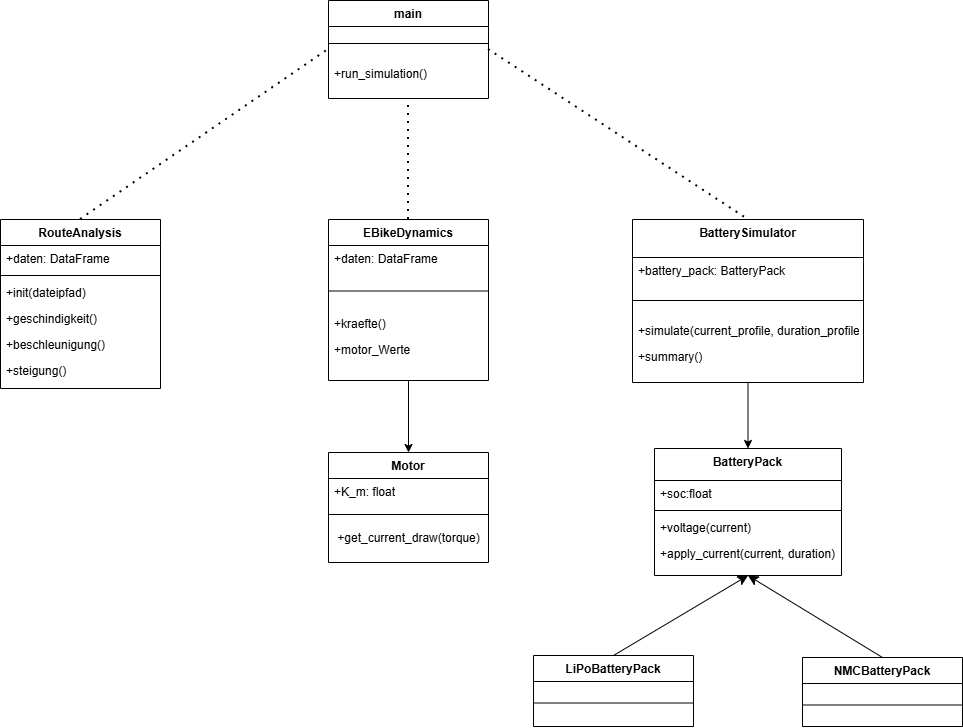
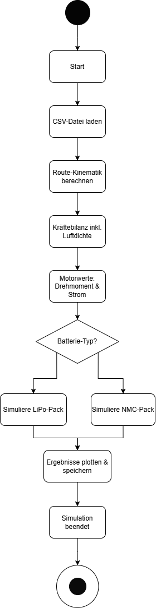

# E-Bike Motor Auslegung

Python application for sizing an e-bike motor and battery from the GPS, time and
temperature data of a real bike ride. It reads the GPS track, computes speed,
acceleration, slope, driving force, motor torque, current and power, reports the
overall ride metrics, and simulates two battery chemistries (LiPo and NMC) over
the ride.

## Requirements

- Python 3.11 or newer (developed on 3.14)
- The packages listed in `requirements.txt` (installed automatically in the steps below)

## Installation

Run all commands **from the project root** (the folder that contains `pyproject.toml`).

1. Get the code:
   ```bash
   git clone https://github.com/JakobFischl/E_Bike_Motor_Auslegung.git
   cd E_Bike_Motor_Auslegung
   ```

2. Create and activate a virtual environment:

   **Windows (PowerShell):**
   ```powershell
   python -m venv .venv
   .venv\Scripts\Activate.ps1
   ```

   **macOS / Linux:**
   ```bash
   python -m venv .venv
   source .venv/bin/activate
   ```

3. Install the project together with its dependencies:
   ```bash
   pip install -e .
   ```
   This installs the pinned packages from `requirements.txt` and makes the
   `route_dynamics` and `ebike_simulation` packages importable.

## Running

From the project root, run:
```bash
python main.py
```

**Important:** the program must be started from the project root, because it loads
the ride data via the relative path `simulation_data/final_project_input_data.csv`.
Running it from another working directory raises `FileNotFoundError`.

The program prints the ride metrics and the battery simulation summary for both
chemistries to the console, and opens the plots (elevation profile, speed, motor
power, and the battery current/SoC/voltage/power profiles) in separate windows.

Log messages are not printed to the console. They are written to
`output/simulation.log`, which is created automatically and overwritten on each run.

## Project structure

```
main.py                     Entry point: runs the full analysis and simulation
pyproject.toml              Project + dependency definition (used by pip install -e .)
requirements.txt            Pinned package versions
simulation_data/            Input GPS data
src/route_dynamics/         GPS route analysis, dynamics, ride metrics, route plots
src/ebike_simulation/       Battery models, simulator, capacity sizer, plots
```
## Project Architecture


### UML-Class Diagram


### Activity Diagram
